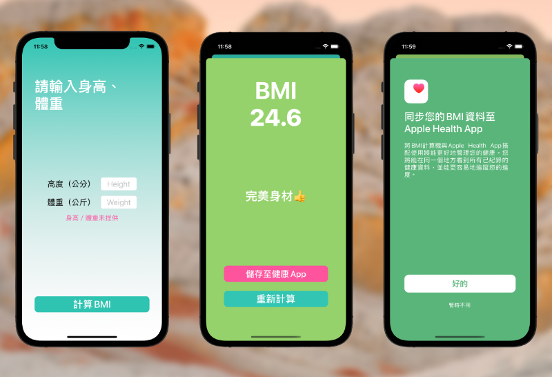

# BMI Calculator
支援上傳蘋果健康App資料的BMI計算機

###### 示範影片：https://youtu.be/U7dHKUY-nM0
###### 自動測試：https://youtu.be/W72Nh8ER8R0

### 功能
* 將計算結果透過HealthKit同步至Apple Health App
* 客製化驗證使用者的輸入，避免不真實的計算結果
* 針對計算結果提供使用者個別的健康建議以及介面
* 本地化：英文、正體中文

### 技術一覽
* MVC, Delegate架構
* UIKit
* NSLocalisedString
* Git version control
* Unit & UI Test in random order (64.7% coverage)

---
### Footnote  
If any issue was spotted within this project, feel free to raise an issue ticket to let me know. 😃
